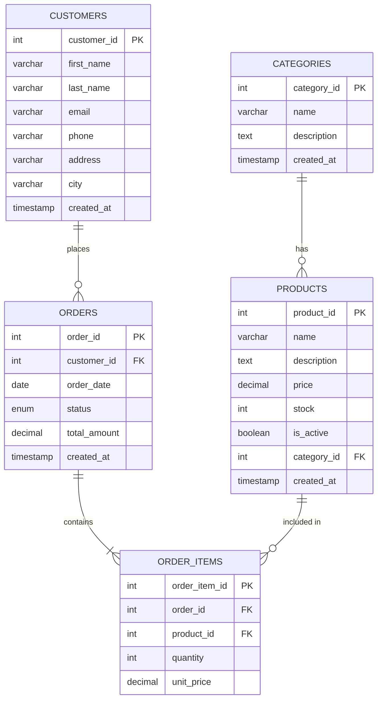

# Lab 02 — Database Design from Case Study

> **Duration:** 2 hours | **Type:** Lab Session | **CO:** CO2  
> **Goal:** Students will learn how to design and implement a database from a case study.

---

## 📋 Session Outline

| Time | Topic | Files |
|------|-------|-------|
| 0:00 – 0:15 | Case study walkthrough | — |
| 0:15 – 0:35 | ERD design with Mermaid | `01_erd_to_schema.sql` |
| 0:35 – 0:55 | Normalization (1NF → 3NF) | `02_normalization.sql` |
| 0:55 – 1:05 | ☕ Break | — |
| 1:05 – 1:25 | Primary & Foreign Keys | `03_primary_foreign_keys.sql` |
| 1:25 – 1:40 | ALTER TABLE operations | `04_alter_table.sql` |
| 1:40 – 1:50 | DROP vs TRUNCATE vs DELETE | `05_drop_truncate.sql` |
| 1:50 – 2:00 | Lab Task briefing | `labtask/` |

---

## 1. The Case Study — E-Commerce System

### 1.1 Business Description

**ShopBD** is an online store that needs a database to manage:

- **Products** are organized into **categories** (e.g., Electronics, Clothing)
- **Customers** register with their contact info and can place **orders**
- Each **order** contains one or more **products** with quantities
- Products have a name, price, stock quantity, and belong to a category
- Each order records date, total amount, and status (pending, shipped, delivered)

### 1.2 Identifying Entities & Attributes

From the description, we extract:

| Entity | Attributes |
|--------|-----------|
| **Categories** | category_id, name, description |
| **Products** | product_id, name, price, stock, description, category |
| **Customers** | customer_id, first_name, last_name, email, phone, address, city |
| **Orders** | order_id, customer, order_date, status, total_amount |
| **Order Items** | order_item_id, order, product, quantity, unit_price |

### 1.3 Identifying Relationships

| Relationship | Type | Description |
|-------------|:----:|-------------|
| Category → Products | 1 : M | One category has many products |
| Customer → Orders | 1 : M | One customer places many orders |
| Order → Order Items | 1 : M | One order has many items |
| Product → Order Items | 1 : M | One product appears in many order items |

---

## 2. Entity-Relationship Diagram (ERD)

### 2.1 What is an ERD?

An ERD is a visual blueprint of your database. It shows:
- **Entities** (tables) as rectangles
- **Attributes** (columns) listed inside
- **Relationships** as lines connecting entities
- **Cardinality** (1:1, 1:M, M:N) shown with symbols

### 2.2 Cardinality Notation

| Symbol | Meaning |
|:------:|---------|
| <code>&#124;&#124;</code> | Exactly one |
| <code>o&#124;</code> | Zero or one |
| <code>&#124;{</code> | One or more |
| <code>o{</code> | Zero or more |

### 2.3 Our E-Commerce ERD



### 2.4 Reading the ERD

- A **CATEGORY** has zero or more **PRODUCTS** → `||--o{`
- A **CUSTOMER** places zero or more **ORDERS** → `||--o{`
- An **ORDER** contains one or more **ORDER_ITEMS** → `||--|{`
- A **PRODUCT** is included in zero or more **ORDER_ITEMS** → `||--o{`

> **Tip:** Open this file in VS Code with the Markdown Preview Enhanced extension or the built-in preview to render the Mermaid diagram.

---

## 3. Normalization

### 3.1 Why Normalize?

Normalization eliminates **data redundancy** and **update anomalies**. Without it:

| Problem | Example |
|---------|---------|
| **Insert Anomaly** | Can't add a new category unless there's a product in it |
| **Update Anomaly** | Changing a category name requires updating every product row |
| **Delete Anomaly** | Deleting the last product in a category loses the category info |

### 3.2 First Normal Form (1NF)

**Rule:** Every column must contain **atomic** (single) values. No repeating groups.

❌ **Not in 1NF:**

| order_id | customer | products |
|:---:|---|---|
| 1 | Rafiq | iPhone, AirPods, Case |
| 2 | Nusrat | Laptop, Mouse |

The `products` column has multiple values — violates 1NF.

✅ **In 1NF:**

| order_id | customer | product |
|:---:|---|---|
| 1 | Rafiq | iPhone |
| 1 | Rafiq | AirPods |
| 1 | Rafiq | Case |
| 2 | Nusrat | Laptop |
| 2 | Nusrat | Mouse |

### 3.3 Second Normal Form (2NF)

**Rule:** Must be in 1NF AND every non-key column must depend on the **entire** primary key (not just part of it).

❌ **Not in 2NF** (composite key: `{order_id, product_id}`):

| order_id | product_id | product_name | quantity |
|:---:|:---:|---|:---:|
| 1 | 101 | iPhone | 1 |
| 1 | 102 | AirPods | 2 |

`product_name` depends only on `product_id`, not the full composite key — **partial dependency**.

✅ **In 2NF:** Separate into two tables:

**order_items:** `{order_id, product_id, quantity}`  
**products:** `{product_id, product_name}`

### 3.4 Third Normal Form (3NF)

**Rule:** Must be in 2NF AND no non-key column depends on another non-key column.

❌ **Not in 3NF:**

| customer_id | name | city | city_area_code |
|:---:|---|---|:---:|
| 1 | Rafiq | Dhaka | 02 |
| 2 | Nusrat | Chittagong | 031 |

`city_area_code` depends on `city`, not on `customer_id` — **transitive dependency**.

✅ **In 3NF:** Separate into two tables:

**customers:** `{customer_id, name, city_id}`  
**cities:** `{city_id, city, area_code}`

### 3.5 Summary

| Normal Form | Rule | Eliminates |
|:-----------:|------|------------|
| **1NF** | Atomic values, no repeating groups | Multi-valued columns |
| **2NF** | No partial dependencies | Part-of-key dependencies |
| **3NF** | No transitive dependencies | Non-key → Non-key dependencies |

> **For this course and most real-world applications, 3NF is sufficient.**

---

## 4. Primary Keys and Foreign Keys

### 4.1 Primary Key (PK)

The primary key **uniquely identifies** each row in a table.

**Rules:**
- Must be `UNIQUE` and `NOT NULL`
- Only **one** primary key per table
- Best practice: use an `AUTO_INCREMENT` integer

**Types of primary keys:**

| Type | Example | Pros | Cons |
|------|---------|------|------|
| **Surrogate** (auto-generated) | `id INT AUTO_INCREMENT` | Simple, performant | No business meaning |
| **Natural** (from data) | `email`, `isbn` | Business meaning | Can change |
| **Composite** (multiple columns) | `(order_id, product_id)` | For junction tables | Complex queries |

### 4.2 Foreign Key (FK)

A foreign key creates a **link** between two tables. It references the primary key of another table.

```sql
CREATE TABLE products (
    product_id  INT AUTO_INCREMENT PRIMARY KEY,
    name        VARCHAR(200) NOT NULL,
    category_id INT,
    FOREIGN KEY (category_id) REFERENCES categories(category_id)
);
```

### 4.3 Referential Integrity Actions

What happens when you DELETE or UPDATE a referenced row?

| Action | ON DELETE | ON UPDATE | Effect |
|--------|-----------|-----------|--------|
| `RESTRICT` | ❌ Block delete | ❌ Block update | Default — prevents orphans |
| `CASCADE` | Delete child rows too | Update child FKs too | Automatic cleanup |
| `SET NULL` | Set FK to NULL | Set FK to NULL | Keep row, lose reference |
| `SET DEFAULT` | Set FK to default | Set FK to default | MySQL limited support |

```sql
FOREIGN KEY (category_id) REFERENCES categories(category_id)
    ON DELETE SET NULL
    ON UPDATE CASCADE
```

---

## 5. Translating ERD to SQL

### Step-by-Step Process

1. **Create tables WITHOUT foreign keys first** (parent tables)
2. **Create tables WITH foreign keys** (child tables)
3. **Add indexes** for frequently queried columns

```sql
-- Step 1: Parent tables first (no FK dependencies)
CREATE TABLE categories (...);
CREATE TABLE customers (...);

-- Step 2: Child tables (reference parent tables)
CREATE TABLE products (..., FOREIGN KEY (category_id) REFERENCES categories(category_id));
CREATE TABLE orders (..., FOREIGN KEY (customer_id) REFERENCES customers(customer_id));

-- Step 3: Junction/detail tables (reference multiple parents)
CREATE TABLE order_items (..., FOREIGN KEY (order_id) REFERENCES orders(order_id),
                               FOREIGN KEY (product_id) REFERENCES products(product_id));
```

> 📁 **See:** `examples/01_erd_to_schema.sql` for the complete implementation

---

## 6. ALTER TABLE — Modifying Tables

After creating a table, you often need to modify it:

```sql
-- Add a new column
ALTER TABLE customers ADD COLUMN date_of_birth DATE;

-- Modify column type/constraints
ALTER TABLE customers MODIFY COLUMN phone VARCHAR(20);

-- Rename a column
ALTER TABLE customers RENAME COLUMN address TO street_address;

-- Drop a column
ALTER TABLE customers DROP COLUMN date_of_birth;

-- Add a constraint after creation
ALTER TABLE products ADD CONSTRAINT chk_price CHECK (price >= 0);

-- Drop a constraint
ALTER TABLE products DROP CONSTRAINT chk_price;

-- Rename a table
ALTER TABLE customers RENAME TO clients;
ALTER TABLE clients RENAME TO customers;  -- rename back
```

> 📁 **See:** `examples/04_alter_table.sql`

---

## 7. DROP vs TRUNCATE vs DELETE

| Feature | `DROP TABLE` | `TRUNCATE TABLE` | `DELETE FROM` |
|---------|:------------:|:-----------------:|:-------------:|
| Removes | Table + data + structure | All data only | Specific rows |
| WHERE clause? | ❌ | ❌ | ✅ |
| Recoverable? | ❌ | ❌ | ✅ (with ROLLBACK) |
| Resets AUTO_INCREMENT? | ✅ | ✅ | ❌ |
| Speed | Fast | Very fast | Slower (row by row) |
| Triggers fire? | ❌ | ❌ | ✅ |

```sql
-- Delete specific rows (DML — can be rolled back)
DELETE FROM products WHERE stock = 0;

-- Remove ALL rows but keep table structure (DDL — cannot be rolled back)
TRUNCATE TABLE order_items;

-- Remove entire table (DDL — cannot be rolled back)
DROP TABLE IF EXISTS order_items;
```

> 📁 **See:** `examples/05_drop_truncate.sql`

---

## ⚠️ Common Pitfalls

| Mistake | Problem | Fix |
|---------|---------|-----|
| Creating child tables before parent tables | FK reference fails | Create parent tables first |
| Forgetting `ON DELETE` strategy | Can't delete parent rows | Choose CASCADE, SET NULL, or handle in app |
| Over-normalizing | Too many JOINs, slow queries | 3NF is usually enough |
| Using natural keys as PK | If email changes, every FK breaks | Use surrogate keys (AUTO_INCREMENT) |
| No ER diagram | Database is built ad-hoc | Always draw ERD first, then code |
| Inconsistent data types for FK pairs | JOIN doesn't match | FK column must match PK column type exactly |

---

## 🔗 In the Industry

- **ERD tools** like MySQL Workbench, dbdiagram.io, and Mermaid are used daily by database architects
- **Normalization** is applied during design, but sometimes **denormalization** is done for performance (read-heavy systems)
- **Schema migrations** (ALTER TABLE) are managed with tools like Flyway or Liquibase in production
- **Foreign keys** are sometimes not enforced in very high-performance systems (like social media feeds) — but always enforced in financial systems

---

## 🧪 Lab Task 2 — Design an E-Commerce Database

**Duration:** 40–50 minutes  
**Difficulty:** ⭐⭐⭐ (Medium)

### Requirements

Design and implement the **ShopBD E-Commerce database** from the case study above:

1. **Draw the ERD** using Mermaid syntax in a markdown file
2. **Create the database** `ecommerce_db`
3. **Create all 5 tables** in the correct order with:
   - Appropriate data types
   - All constraints (PK, FK, NOT NULL, UNIQUE, DEFAULT, CHECK)
   - Proper `ON DELETE` and `ON UPDATE` actions
4. **Insert sample data:**
   - 5 categories
   - 10 products (at least 2 per category)
   - 5 customers
   - 5 orders across different customers
   - 15 order items across the orders
5. **Verify** with `SELECT * FROM each_table;`

### Grading Criteria

| Criteria | Points |
|----------|:------:|
| Mermaid ERD with all entities and relationships | 15 |
| Tables created in correct dependency order | 10 |
| Correct data types for all columns | 15 |
| All constraints (PK, FK, NOT NULL, UNIQUE, CHECK) | 20 |
| Referential integrity actions (ON DELETE/UPDATE) | 10 |
| Realistic sample data | 15 |
| Naming conventions and code formatting | 5 |
| All SELECT queries return expected results | 10 |
| **Total** | **100** |

### Bonus Challenge ⭐

Add a `product_reviews` table where customers can rate products (1–5 stars) with a comment. Include proper foreign keys and a CHECK constraint on the rating.

---

**📁 Reference Solution:** `lab_02_database_design/labtask/solution.sql`
