# Lab 04 — Intermediate SQL Queries

> **Duration:** 2 hours | **Type:** Lab Session | **CO:** CO1  
> **Goal:** Master JOINs, aggregate functions, GROUP BY, HAVING, subqueries, and set operations.  
> **Prerequisites:** Lab 02 E-Commerce database with sample data.

---

## 📋 Session Outline

| Time | Topic | Files |
|------|-------|-------|
| 0:00 – 0:20 | INNER JOIN | `01_inner_join.sql` |
| 0:20 – 0:35 | LEFT/RIGHT JOIN | `02_left_right_join.sql` |
| 0:35 – 0:45 | Self & Cross JOIN | `03_self_cross_join.sql` |
| 0:45 – 0:55 | Aggregate functions | `04_aggregate_functions.sql` |
| 0:55 – 1:05 | ☕ Break | — |
| 1:05 – 1:20 | GROUP BY & HAVING | `05_group_by_having.sql` |
| 1:20 – 1:35 | Subqueries | `06_subqueries.sql` |
| 1:35 – 1:45 | EXISTS & IN | `07_exists_in.sql` |
| 1:45 – 1:55 | UNION | `08_union_intersect.sql` |
| 1:55 – 2:00 | Lab Task | `labtask/` |

---

## 1. Joins — Combining Tables

### 1.1 Why JOINs?

In a normalized database, data is spread across multiple tables. To get meaningful answers, you need to **combine** them:

- "Which products belong to which category?" → products + categories
- "Who ordered what?" → customers + orders + order_items + products

> **Real-world analogy:** Think of JOINs like matching students to their sections using a shared `section_id`. The student table has the `section_id`, and the section table has the details. JOIN is how you look up the section name for each student.

### 1.2 How JOINs Work — The Matching Process

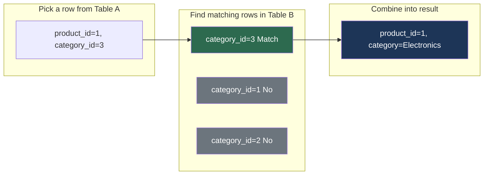

### 1.3 Types of JOINs — Visual Overview

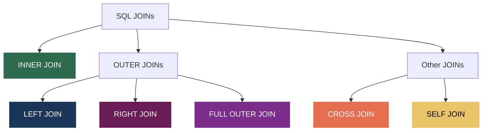

| JOIN Type | Description |
|---|---|
| **INNER JOIN** | Only matching rows from BOTH tables |
| **LEFT JOIN** | ALL from left + matching from right |
| **RIGHT JOIN** | ALL from right + matching from left |
| **FULL OUTER JOIN** | ALL from both (MySQL: use UNION) |
| **CROSS JOIN** | Every combination (Cartesian product) |
| **SELF JOIN** | A table joined with itself |

### 1.4 Quick Reference — What Each Join Returns

| JOIN Type | Returns | NULL Behavior |
|-----------|---------|---------------|
| `INNER JOIN` | Only rows that match in **both** tables | No NULLs from join |
| `LEFT JOIN` | **All** rows from left table + matching from right | NULL if no match on right |
| `RIGHT JOIN` | **All** rows from right table + matching from left | NULL if no match on left |
| `CROSS JOIN` | Every possible combination (Cartesian product) | No NULLs from join |
| `SELF JOIN` | A table joined with itself | Depends on join type used |

---

## 2. INNER JOIN

### 2.1 Concept — Only the Overlap

**INNER JOIN** returns only the rows that have a matching value in **both** tables. If a row in Table A has no match in Table B, it is **excluded** from the result.

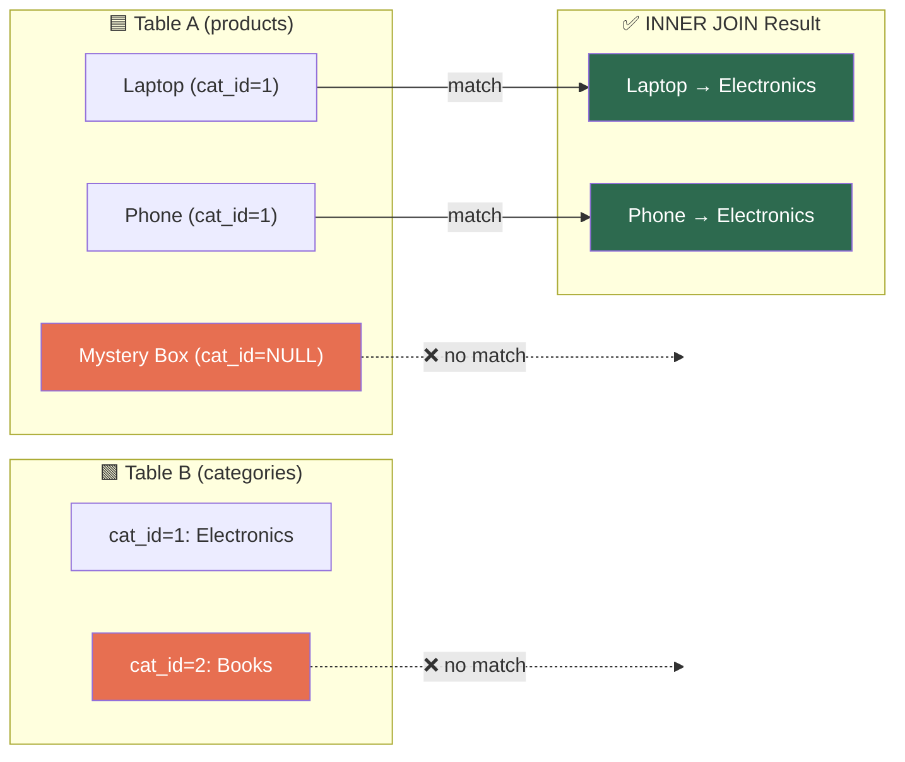

### 2.2 Example with Sample Data

**Given these tables:**

**products**

| product_id | name | price | category_id |
|:---:|---|---:|:---:|
| 1 | iPhone 15 | 129999.00 | 1 |
| 2 | Samsung Galaxy | 89999.00 | 1 |
| 3 | Cotton T-Shirt | 599.00 | 2 |
| 4 | Mystery Box | 999.00 | **NULL** |

**categories**

| category_id | name |
|:---:|---|
| 1 | Electronics |
| 2 | Clothing |
| 3 | Books |

**Query:**

```sql
SELECT p.name AS product, p.price, c.name AS category
FROM products p
INNER JOIN categories c ON p.category_id = c.category_id;
```

**Result:** _(only rows where `category_id` exists in BOTH tables)_

| product | price | category |
|---|---:|---|
| iPhone 15 | 129999.00 | Electronics |
| Samsung Galaxy | 89999.00 | Electronics |
| Cotton T-Shirt | 599.00 | Clothing |

> ❌ **"Mystery Box"** is excluded — it has `category_id = NULL`, which doesn't match anything.  
> ❌ **"Books"** category doesn't appear — no products have `category_id = 3`.

### 2.3 Multi-Table JOIN

You can chain multiple JOINs to connect 3, 4, or more tables:

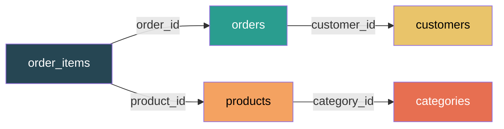

```sql
-- Products with their category names
SELECT p.name AS product, p.price, c.name AS category
FROM products p
INNER JOIN categories c ON p.category_id = c.category_id;

-- Orders with customer names
SELECT o.order_id, 
       CONCAT(cu.first_name, ' ', cu.last_name) AS customer,
       o.order_date, o.status, o.total_amount
FROM orders o
INNER JOIN customers cu ON o.customer_id = cu.customer_id;

-- Multi-table JOIN: order details with product and customer info
SELECT o.order_id,
       CONCAT(cu.first_name, ' ', cu.last_name) AS customer,
       p.name AS product,
       oi.quantity,
       oi.unit_price,
       (oi.quantity * oi.unit_price) AS line_total
FROM order_items oi
INNER JOIN orders o ON oi.order_id = o.order_id
INNER JOIN customers cu ON o.customer_id = cu.customer_id
INNER JOIN products p ON oi.product_id = p.product_id;
```

**Multi-table result example:**

| order_id | customer | product | quantity | unit_price | line_total |
|:---:|---|---|:---:|---:|---:|
| 1 | Rafiq Ahmed | iPhone 15 | 1 | 129999.00 | 129999.00 |
| 1 | Rafiq Ahmed | AirPods Pro | 2 | 24999.00 | 49998.00 |
| 2 | Nusrat Jahan | Cotton T-Shirt | 3 | 599.00 | 1797.00 |

---

## 3. LEFT / RIGHT JOIN

### 3.1 LEFT JOIN — Keep Everything from the Left

**LEFT JOIN** returns **all rows from the left table**, even if there's no match. If there's no match, the right table's columns are filled with `NULL`.

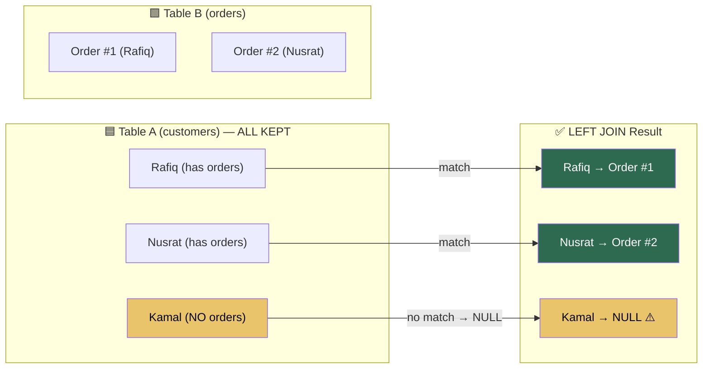

### 3.2 LEFT JOIN — Concrete Example

**customers**

| customer_id | first_name | last_name |
|:---:|---|---|
| 1 | Rafiq | Ahmed |
| 2 | Nusrat | Jahan |
| 3 | Kamal | Hossain |

**orders**

| order_id | customer_id | order_date | status |
|:---:|:---:|---|---|
| 101 | 1 | 2024-01-15 | delivered |
| 102 | 2 | 2024-02-20 | shipped |

**Query:**

```sql
SELECT cu.first_name, cu.last_name, o.order_id, o.order_date
FROM customers cu
LEFT JOIN orders o ON cu.customer_id = o.customer_id;
```

**Result:**

| first_name | last_name | order_id | order_date |
|---|---|:---:|---|
| Rafiq | Ahmed | 101 | 2024-01-15 |
| Nusrat | Jahan | 102 | 2024-02-20 |
| Kamal | Hossain | **NULL** | **NULL** |

> ✅ Kamal appears even though he has no orders — the order columns are filled with **NULL**.

### 3.3 The "Find Missing" Pattern (LEFT JOIN + WHERE IS NULL)

This is one of the most practical patterns in SQL — finding records that **don't** have a corresponding entry in another table:

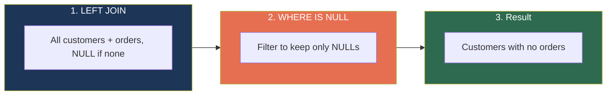

```sql
-- ALL products, even those without a category
SELECT p.name, p.price, c.name AS category
FROM products p
LEFT JOIN categories c ON p.category_id = c.category_id;

-- Find products WITHOUT a category (orphaned products)
SELECT p.name, p.price
FROM products p
LEFT JOIN categories c ON p.category_id = c.category_id
WHERE c.category_id IS NULL;
```

**Before filter (LEFT JOIN only):**

| name | price | category |
|---|---:|---|
| iPhone 15 | 129999.00 | Electronics |
| Samsung Galaxy | 89999.00 | Electronics |
| Cotton T-Shirt | 599.00 | Clothing |
| Mystery Box | 999.00 | **NULL** |

**After filter (+ WHERE IS NULL):**

| name | price |
|---|---:|
| Mystery Box | 999.00 |

### 3.4 RIGHT JOIN

Same concept but reversed — **all rows from the right table** are kept.

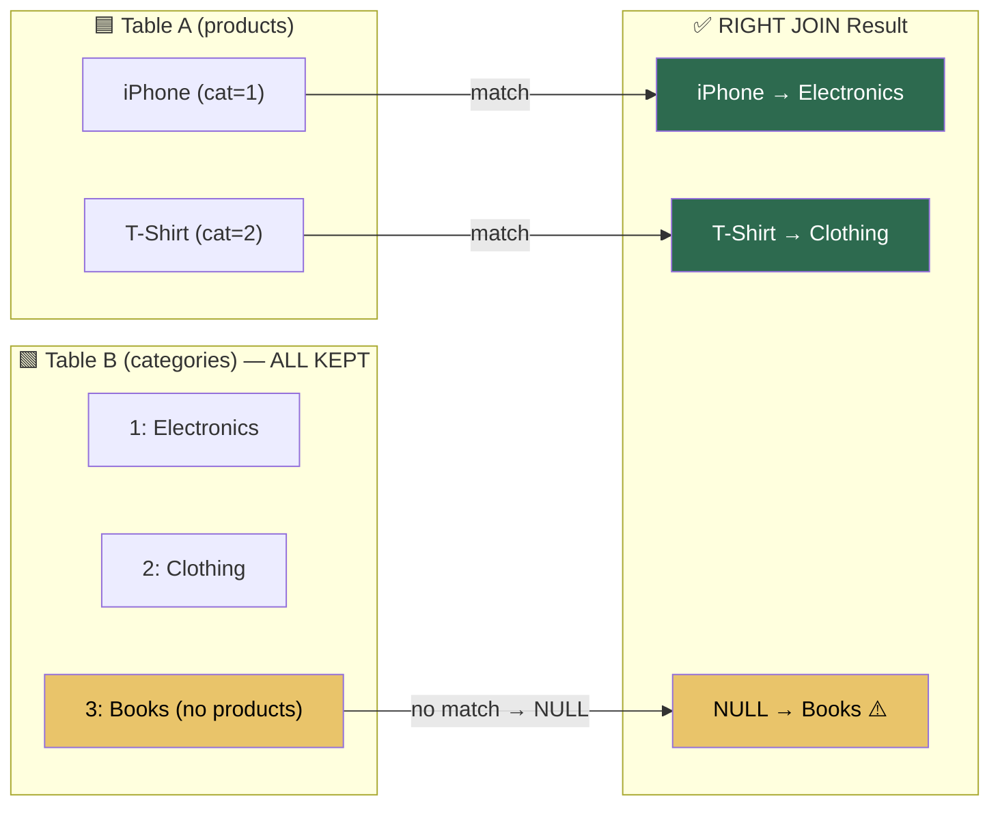

```sql
-- ALL categories, even those with no products
SELECT c.name AS category, p.name AS product
FROM products p
RIGHT JOIN categories c ON p.category_id = c.category_id;

-- Find empty categories (no products)
SELECT c.name AS empty_category
FROM products p
RIGHT JOIN categories c ON p.category_id = c.category_id
WHERE p.product_id IS NULL;
```

**Result of RIGHT JOIN:**

| category | product |
|---|---|
| Electronics | iPhone 15 |
| Electronics | Samsung Galaxy |
| Clothing | Cotton T-Shirt |
| Books | **NULL** |

> **Tip:** `LEFT JOIN` is more common. You can always rewrite a `RIGHT JOIN` as a `LEFT JOIN` by swapping the table order.

### 3.5 LEFT vs INNER vs RIGHT — Side-by-Side Comparison

Let's use two tiny tables to see the difference clearly:

**Table A: `students`**

| id | name |
|:---:|---|
| 1 | Rafiq |
| 2 | Nusrat |
| 3 | Kamal |

**Table B: `enrollments`**

| student_id | course |
|:---:|---|
| 1 | RDBMS |
| 2 | OOP |
| 99 | Networking |

> Notice: **Kamal (id=3)** has no enrollment. **Networking (student_id=99)** has no matching student.

---

#### INNER JOIN — only matching rows

```sql
SELECT s.name, e.course
FROM students s
INNER JOIN enrollments e ON s.id = e.student_id;
```

| name | course |
|---|---|
| Rafiq | RDBMS |
| Nusrat | OOP |

> ❌ Kamal is gone (no enrollment). ❌ Networking is gone (no student).

---

#### LEFT JOIN — keep ALL students

```sql
SELECT s.name, e.course
FROM students s
LEFT JOIN enrollments e ON s.id = e.student_id;
```

| name | course |
|---|---|
| Rafiq | RDBMS |
| Nusrat | OOP |
| **Kamal** | **NULL** |

> ✅ Kamal is kept with NULL. ❌ Networking is still gone.

---

#### RIGHT JOIN — keep ALL enrollments

```sql
SELECT s.name, e.course
FROM students s
RIGHT JOIN enrollments e ON s.id = e.student_id;
```

| name | course |
|---|---|
| Rafiq | RDBMS |
| Nusrat | OOP |
| **NULL** | **Networking** |

> ❌ Kamal is gone. ✅ Networking is kept with NULL.

---

#### Summary

| Row | INNER | LEFT | RIGHT |
|---|:---:|:---:|:---:|
| Rafiq — RDBMS | ✅ | ✅ | ✅ |
| Nusrat — OOP | ✅ | ✅ | ✅ |
| Kamal — ??? | ❌ | ✅ (NULL) | ❌ |
| ??? — Networking | ❌ | ❌ | ✅ (NULL) |
| **Total rows** | **2** | **3** | **3** |

---

## 4. Self JOIN and Cross JOIN

### 4.1 Self JOIN — a Table Joined with Itself

A **self join** is when a table has a foreign key that points **back to its own primary key**. The classic example is an org chart:

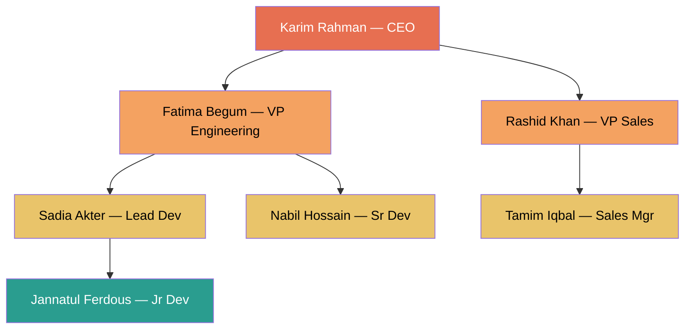

The trick is to treat **the same table as two different tables** using aliases:

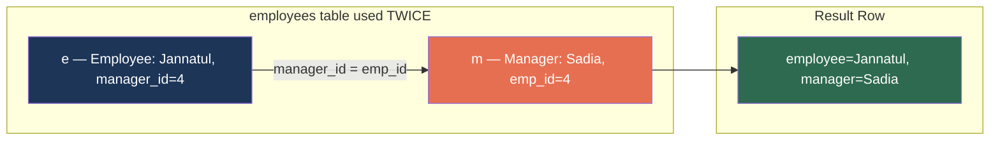

```sql
-- Example: Employees table with manager hierarchy
CREATE TABLE employees (
    emp_id INT AUTO_INCREMENT PRIMARY KEY,
    name VARCHAR(100),
    manager_id INT,
    FOREIGN KEY (manager_id) REFERENCES employees(emp_id)
);

INSERT INTO employees (name, manager_id) VALUES
    ('CEO', NULL), ('VP Sales', 1), ('VP Tech', 1),
    ('Sales Manager', 2), ('Developer', 3);

-- Find each employee's manager
SELECT e.name AS employee, m.name AS manager
FROM employees e
LEFT JOIN employees m ON e.manager_id = m.emp_id;

DROP TABLE employees;
```

**Result:**

| employee | manager |
|---|---|
| CEO | **NULL** |
| VP Sales | CEO |
| VP Tech | CEO |
| Sales Manager | VP Sales |
| Developer | VP Tech |

> 💡 We use `LEFT JOIN` (not `INNER JOIN`) so the CEO (who has no manager) still appears.

### 4.2 Cross JOIN — Cartesian Product

**CROSS JOIN** combines **every row** from Table A with **every row** from Table B. If A has `m` rows and B has `n` rows, the result has `m × n` rows.

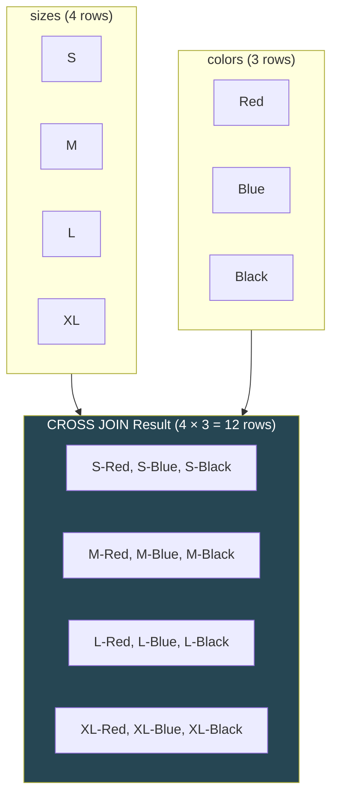

**Example result:**

| size | color |
|:---:|---|
| S | Red |
| S | Blue |
| S | Black |
| M | Red |
| M | Blue |
| M | Black |
| L | Red |
| L | Blue |
| L | Black |
| XL | Red |
| XL | Blue |
| XL | Black |

```sql
-- Every product paired with every category (usually not useful)
SELECT p.name, c.name
FROM products p
CROSS JOIN categories c
LIMIT 20;
-- If 10 products × 5 categories = 50 rows
```

> ⚠️ **Be careful!** `CROSS JOIN` can produce enormous result sets. 1000 × 1000 = 1,000,000 rows!

### 4.3 JOIN Decision Guide — Which JOIN Do I Need?

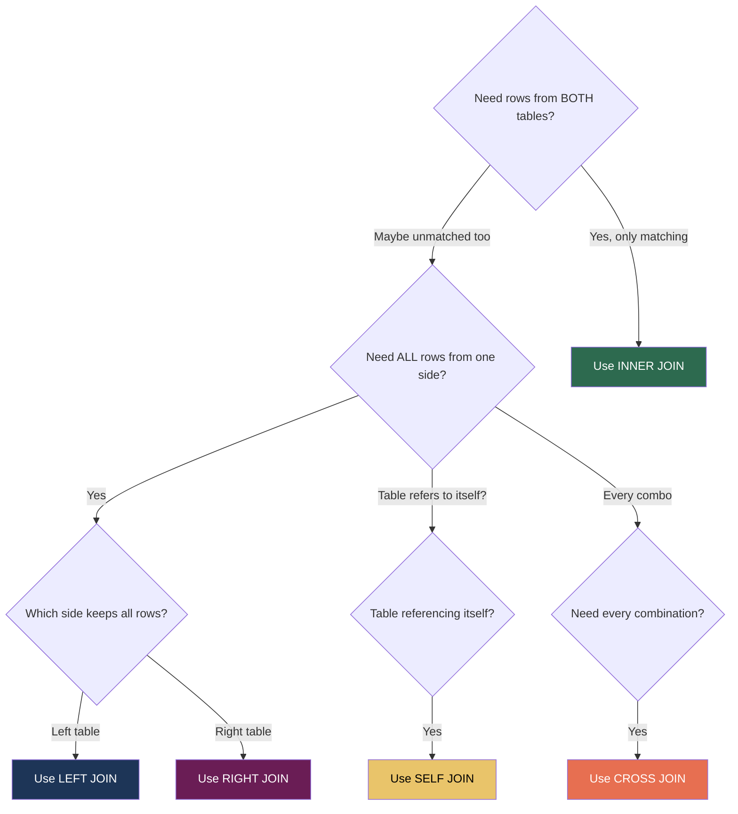

---

## 5. Aggregate Functions

Aggregate functions compute a **single value** from a set of rows.

| Function | Purpose | Example |
|----------|---------|---------|
| `COUNT(*)` | Count all rows | `SELECT COUNT(*) FROM products;` |
| `COUNT(col)` | Count non-NULL values | `COUNT(description)` |
| `SUM(col)` | Sum of values | `SUM(price * stock)` |
| `AVG(col)` | Average | `AVG(price)` |
| `MIN(col)` | Minimum value | `MIN(price)` |
| `MAX(col)` | Maximum value | `MAX(price)` |

### 5.1 Visual — How Aggregates Collapse Rows

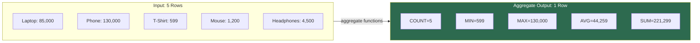

```sql
-- Product statistics
SELECT 
    COUNT(*) AS total_products,
    MIN(price) AS cheapest,
    MAX(price) AS most_expensive,
    ROUND(AVG(price), 2) AS average_price,
    SUM(stock) AS total_stock,
    SUM(price * stock) AS total_inventory_value
FROM products;
```

**Result (single row):**

| total_products | cheapest | most_expensive | average_price | total_stock | total_inventory_value |
|:---:|---:|---:|---:|:---:|---:|
| 10 | 299.00 | 129999.00 | 28459.70 | 750 | 21344775.00 |

---

## 6. GROUP BY and HAVING

### 6.1 GROUP BY — Group Rows by Column

`GROUP BY` splits the rows into groups, then applies aggregate functions **per group**.

```mermaid
flowchart LR
    subgraph Input["All Products"]
        R1["Laptop — Electronics"]
        R2["Phone — Electronics"]
        R3["Mouse — Electronics"]
        R4["T-Shirt — Clothing"]
        R5["Jeans — Clothing"]
        R6["Novel — Books"]
    end
    subgraph Groups["GROUP BY category"]
        G1["Electronics: Laptop, Phone, Mouse"]
        G2["Clothing: T-Shirt, Jeans"]
        G3["Books: Novel"]
    end
    subgraph Result["COUNT per group"]
        O1["Electronics: 3"]
        O2["Clothing: 2"]
        O3["Books: 1"]
    end
    Input --> Groups --> Result
    style G1 fill:#264653,color:#fff
    style G2 fill:#2a9d8f,color:#fff
    style G3 fill:#e9c46a,color:#000
```

```sql
-- Count products per category
SELECT c.name AS category, COUNT(*) AS product_count
FROM products p
JOIN categories c ON p.category_id = c.category_id
GROUP BY c.name;

-- Total revenue per customer
SELECT CONCAT(cu.first_name, ' ', cu.last_name) AS customer,
       COUNT(o.order_id) AS order_count,
       SUM(o.total_amount) AS total_spent
FROM customers cu
JOIN orders o ON cu.customer_id = o.customer_id
GROUP BY cu.customer_id;
```

**Example result:**

| category | product_count |
|---|:---:|
| Electronics | 4 |
| Clothing | 3 |
| Books | 2 |
| Home & Kitchen | 1 |

### 6.2 HAVING — Filtering Groups (like WHERE but for Aggregates)

```mermaid
flowchart LR
    subgraph Step1["① GROUP BY"]
        direction TB
        G1["Electronics: 4 products"]
        G2["Clothing: 3 products"]
        G3["Books: 2 products"]
        G4["Home: 1 product"]
    end
    subgraph Step2["② HAVING COUNT > 2"]
        direction TB
        H1["Electronics: 4 ✅"]
        H2["Clothing: 3 ✅"]
        H3["Books: 2 ❌"]
        H4["Home: 1 ❌"]
    end
    subgraph Result["③ Final Result"]
        direction TB
        R1["Electronics: 4"]
        R2["Clothing: 3"]
    end
    Step1 --> Step2 --> Result
    style H1 fill:#2d6a4f,color:#fff
    style H2 fill:#2d6a4f,color:#fff
    style H3 fill:#e76f51,color:#fff
    style H4 fill:#e76f51,color:#fff
```

```sql
-- Categories with more than 2 products
SELECT c.name, COUNT(*) AS product_count
FROM products p
JOIN categories c ON p.category_id = c.category_id
GROUP BY c.name
HAVING COUNT(*) > 2;

-- Customers who spent more than 50,000 BDT
SELECT CONCAT(cu.first_name, ' ', cu.last_name) AS customer,
       SUM(o.total_amount) AS total_spent
FROM customers cu
JOIN orders o ON cu.customer_id = o.customer_id
GROUP BY cu.customer_id
HAVING SUM(o.total_amount) > 50000;
```

### 6.3 WHERE vs HAVING — Execution Order


| | WHERE | HAVING |
|---|---|---|
| Filters | Individual rows | Groups |
| Runs | **Before** GROUP BY | **After** GROUP BY |
| Can use aggregates? | ❌ No | ✅ Yes |

**Example — using both together:**

```sql
-- Categories with more than 2 ACTIVE products priced above 500 BDT
SELECT c.name, COUNT(*) AS product_count
FROM products p
JOIN categories c ON p.category_id = c.category_id
WHERE p.price > 500         -- ← filters individual rows FIRST
  AND p.is_active = TRUE
GROUP BY c.name
HAVING COUNT(*) > 2;        -- ← then filters the groups
```

---

## 7. Subqueries

A subquery is a query nested inside another query.

### 7.1 Scalar Subquery (returns single value)

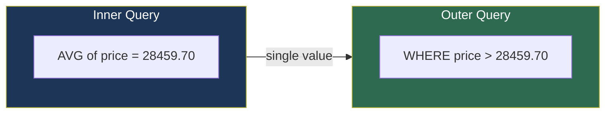

```sql
-- Products priced above average
SELECT name, price FROM products
WHERE price > (SELECT AVG(price) FROM products);

-- Most expensive product
SELECT name, price FROM products
WHERE price = (SELECT MAX(price) FROM products);
```

### 7.2 Row Subquery (returns multiple values)

```sql
-- Products in the most popular category
SELECT name, price FROM products
WHERE category_id = (
    SELECT category_id FROM products
    GROUP BY category_id
    ORDER BY COUNT(*) DESC
    LIMIT 1
);
```

### 7.3 Table Subquery (returns a result set)

```sql
-- Customers who have placed orders
SELECT first_name, last_name FROM customers
WHERE customer_id IN (
    SELECT DISTINCT customer_id FROM orders
);
```

### 7.4 Correlated Subquery

A **correlated subquery** runs once for **each row** in the outer query — it references the outer query's columns.

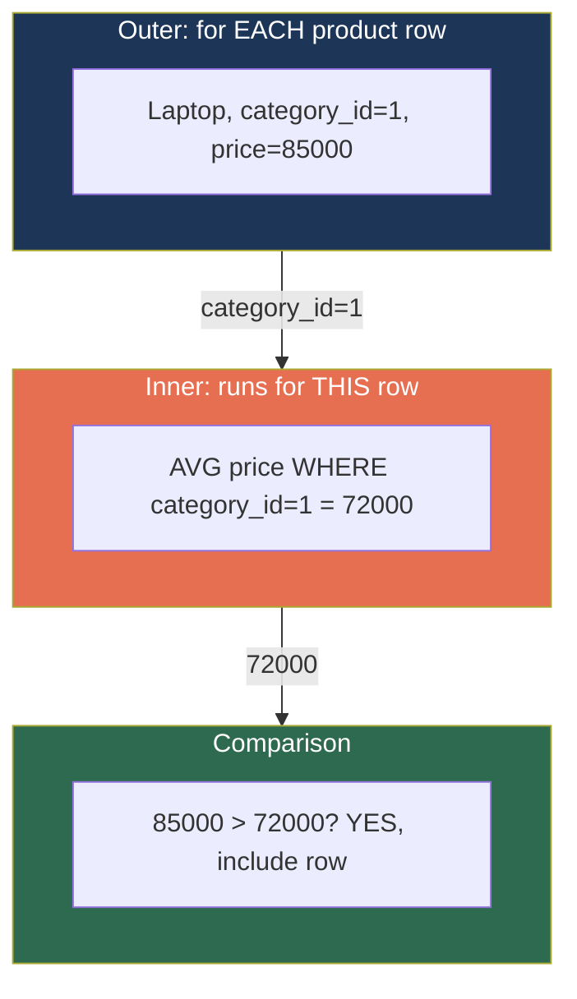

```sql
-- Products priced above their category's average
SELECT p.name, p.price, p.category_id
FROM products p
WHERE p.price > (
    SELECT AVG(p2.price) FROM products p2
    WHERE p2.category_id = p.category_id
);
```

**Step-by-step for Electronics (category_id=1):**

| product | price | category avg | Above avg? |
|---|---:|---:|:---:|
| iPhone 15 | 129999 | 72000 | ✅ Yes |
| Samsung Galaxy | 89999 | 72000 | ✅ Yes |
| Mouse | 1200 | 72000 | ❌ No |
| Headphones | 4500 | 72000 | ❌ No |

---

## 8. EXISTS vs IN

### 8.1 EXISTS — Checks if Subquery Returns Any Rows

`EXISTS` returns `TRUE` if the subquery produces **at least one row**, and `FALSE` if it produces zero rows. It doesn't care about the actual values.

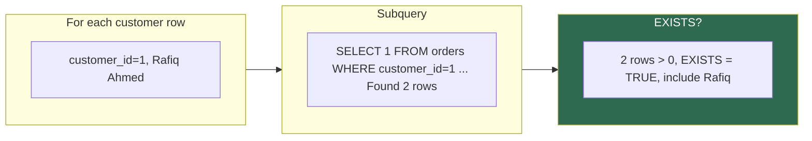

```sql
-- Customers who have orders
SELECT first_name, last_name FROM customers cu
WHERE EXISTS (
    SELECT 1 FROM orders o WHERE o.customer_id = cu.customer_id
);

-- Customers who have NOT ordered
SELECT first_name, last_name FROM customers cu
WHERE NOT EXISTS (
    SELECT 1 FROM orders o WHERE o.customer_id = cu.customer_id
);
```

### 8.2 IN vs EXISTS — When to Use Which

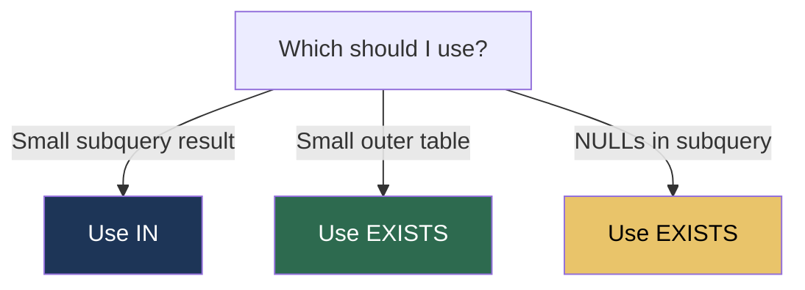

| | `IN` | `EXISTS` |
|---|---|---|
| Best when | Subquery result is **small** | Outer table is **small** |
| Evaluates | Entire subquery first | Stops at first match |
| NULL handling | Can give unexpected results | Handles NULLs correctly |

---

## 9. Set Operations

### 9.1 UNION — Combining Result Sets

`UNION` stacks two queries on top of each other (vertically), removing duplicates. `UNION ALL` keeps duplicates.

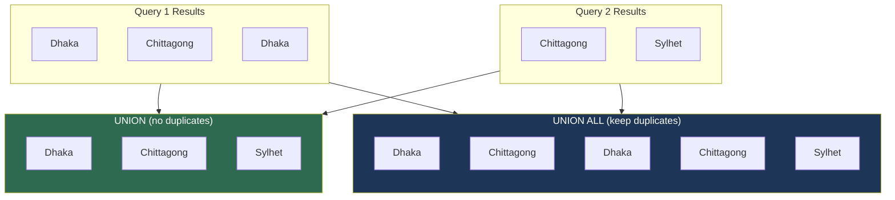

```sql
-- UNION: combine results, remove duplicates
SELECT city FROM customers
UNION
SELECT 'Online' AS city;

-- UNION ALL: combine results, KEEP duplicates (faster)
SELECT city FROM customers
UNION ALL
SELECT city FROM customers;
```

### 9.2 UNION Rules

| Rule | Explanation |
|------|-------------|
| Same number of columns | Both queries must return the same column count |
| Compatible data types | Column 1 in Query A must match Column 1 in Query B |
| Column names from first query | The result uses column names from the first SELECT |

---

## ⚠️ Common Pitfalls

| Mistake | Problem | Fix |
|---------|---------|-----|
| SELECT non-grouped column | Error or random value | Add to GROUP BY or use aggregate |
| HAVING without GROUP BY | Treats entire result as one group | Add GROUP BY first |
| Cartesian product | Missing JOIN condition → millions of rows | Always specify ON clause |
| Wrong JOIN type | Missing data or extra NULLs | Choose LEFT/INNER carefully |
| Subquery returns multiple rows with `=` | Error | Use `IN` instead of `=` |

---

## 📐 Complete JOIN Cheatsheet

| JOIN | SQL Pattern | Use Case | Row Count |
|------|-------------|----------|-----------|
| **INNER** | `A INNER JOIN B ON A.id = B.id` | Show only matching data | ≤ min(A, B) |
| **LEFT** | `A LEFT JOIN B ON A.id = B.id` | Keep all from A, even without match | ≥ rows in A |
| **RIGHT** | `A RIGHT JOIN B ON A.id = B.id` | Keep all from B, even without match | ≥ rows in B |
| **CROSS** | `A CROSS JOIN B` | Generate all combinations | A × B |
| **SELF** | `A e1 JOIN A e2 ON e1.col = e2.col` | Hierarchy, compare rows | Varies |
| **LEFT + NULL** | `A LEFT JOIN B ... WHERE B.key IS NULL` | Find orphans / missing | ≤ rows in A |

---

## 🔗 In the Industry

- **JOINs** are the backbone of every reporting system and business intelligence tool
- **GROUP BY** powers every dashboard chart: sales per month, users per country
- **Subqueries** are used in complex filtering but **CTEs** (Common Table Expressions) are preferred in modern SQL
- **EXISTS** is often faster than `IN` for large datasets — database optimizers are smart but not perfect

---

## 🧪 Lab Task 4 — Analytical Query Challenge

**Duration:** 40 minutes  
**Difficulty:** ⭐⭐⭐⭐ (Medium-Hard)

Write 12 queries using the `ecommerce_db`:

1. List all products with their category name
2. List all orders with customer full name and order status
3. Show full order details: order ID, customer name, product name, quantity, unit price, line total
4. Find categories that have no products (empty categories)
5. Find customers who have not placed any orders
6. Count the number of products per category
7. Show total revenue per category (sum of quantity × unit_price in order_items)
8. Find the most expensive product in each category
9. Find customers who have spent more than 100,000 BDT total
10. Find products that are priced above the overall average price
11. Find the category with the highest total revenue
12. List orders that contain more than 2 items

### Grading Criteria

| Criteria | Points |
|----------|:------:|
| Queries 1–4 (JOINs) | 30 |
| Queries 5–8 (GROUP BY, LEFT JOIN) | 30 |
| Queries 9–12 (Subqueries, Complex) | 30 |
| Code formatting and comments | 10 |
| **Total** | **100** |

---

**📁 Reference Solution:** `lab_04_intermediate_sql/labtask/solution.sql`
